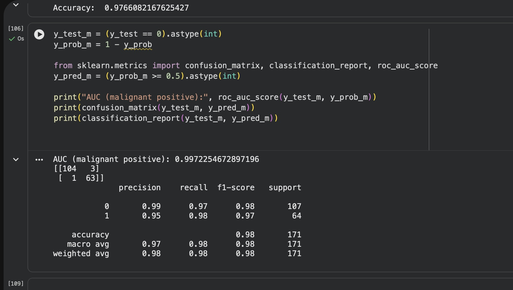

# Breast Cancer Classification with Neural Network

This project demonstrates a binary classification task using a feedforward neural network on the **Breast Cancer Wisconsin (Diagnostic)** dataset from scikit-learn.

The goal is to classify tumors as **benign** or **malignant** based on 30 numerical features extracted from digitized images of breast tissue.

---

## 📊 Dataset
- Source: scikit-learn (`load_breast_cancer`)
- Samples: 569
- Features: 30 numerical features
- Classes:
  - 0 → Malignant
  - 1 → Benign

---

## Model Architecture
- Input layer: 30 features
- Hidden layers:
  - Dense (15 neurons, ReLU)
  - Dropout (0.3)
  - Dense (15 neurons, ReLU)
  - Dense (15 neurons, ReLU)
- Output layer:
  - Dense (1 neuron, Sigmoid)

---

## ⚙️ Training Details
- Optimizer: Adam
- Loss function: Binary Crossentropy
- Batch size: 32
- Epochs: up to 200
- Early Stopping:
  - Monitor: validation loss
  - Patience: 10
  - Restore best weights enabled

---

## 📈 Evaluation Metrics
- Accuracy
- Precision
- Recall
- F1-score
- ROC-AUC
- Confusion Matrix

---

##🧪 Results
**Test Accuracy:** ~97.7%  
**ROC-AUC (Malignant as Positive Class):** ~0.997

### Confusion Matrix


### Classification Report


---

**Note on class labels:**  
In the original dataset, labels are encoded as `0 = malignant` and `1 = benign`.  
For evaluation purposes, malignant tumors are treated as the **positive class**, and labels are remapped accordingly when computing ROC-AUC and the confusion matrix.


## 🔁 Reproducibility

All experiments are reproducible using:

```python
SEED = 42
```

## Technologies Used
	•	Python
	•	NumPy
	•	scikit-learn
	•	TensorFlow / Keras
	•	Matplotlib

## ▶️ How to Run
1. Clone the repository
2. Open the notebook:
   `breast_cancer_classification_neural_network.ipynb`
3. Run all cells sequentially

The project was developed and tested using Google Colab.

## 🏥 Why Precision and Recall Matter
In medical diagnosis tasks, recall is especially critical to minimize false negatives (missing malignant cases).
Precision is also important to avoid unnecessary stress and treatment for benign cases.
## 📝 Notes
This project focuses on interpretability, reproducibility, and real-world evaluation rather than model complexity.


