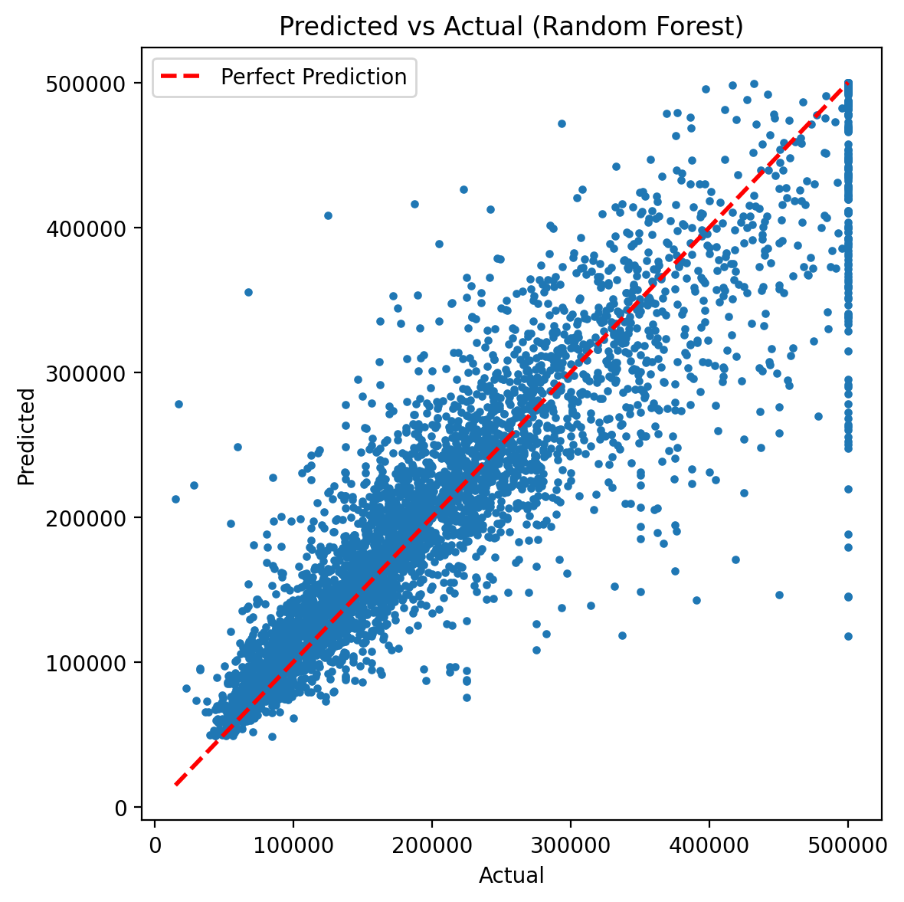
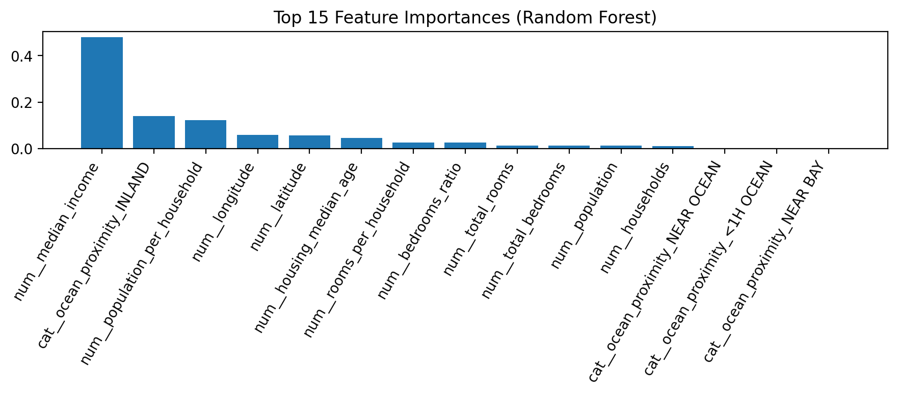

# California Housing Price Prediction

This project predicts median house values using the California housing dataset.
An end-to-end regression pipeline was built including preprocessing, feature engineering, and model comparison.

## Dataset
- Target: `median_house_value`
- Features: location (longitude, latitude), median income, rooms, population, and ocean proximity

## Feature Engineering
- rooms_per_household
- population_per_household
- bedrooms_ratio

Missing values were handled using median imputation.

## Models
- Linear Regression (baseline)
- Random Forest Regressor (final model)

## Results
Random Forest achieved significantly better performance.

- R² ≈ 0.81
- RMSE ≈ 49k

## Visualizations

### Predicted vs Actual

### Feature Importances

Median income and location-related features were the strongest predictors.
